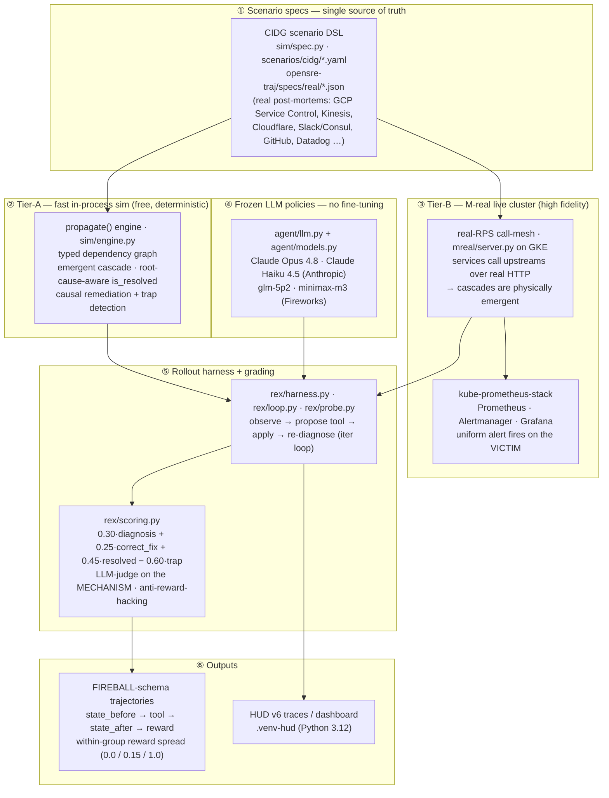

# SRE-Degrees — Architecture

**What we're building:** an RL **environment + trajectory generator** for autonomous
incident response, where the hard part is reproduced faithfully — *cascading* outages whose
*loudest alert points at a victim, not the cause*, where the *naive fix makes it worse*. The
LLM is a **frozen, swappable policy** (no fine-tuning); reliability comes from the
**environment + a root-cause-aware reward**, in the spirit of code-as-policy / auto-harness.

## The thesis in one line

> A real production cascade misleads even frontier models on the first try; a reward that
> grades **root cause + correct fix + trap-avoidance** (not just "did it come back up")
> produces trajectory data with genuine within-group signal.

We verified both halves: faulting one node propagates to a downstream victim on a real GKE
cluster, and the grader cleanly separates "looks resolved" (reward 0.45) from a clean win
(1.0), with the trap penalised (−0.60).

## System diagram



## Why each piece exists

| # | Component | Role | Status |
|---|---|---|---|
| ① | **Scenario specs** (`sim/spec.py`, `scenarios/cidg/`, `opensre-traj/specs/real/`) | Declarative topology + hidden root cause + trap + correct fix. Cascades are *derived*, never scripted. One spec drives both tiers. | ✅ 9 CIDG + larger `opensre-traj` catalog, validated |
| ② | **Tier-A sim** (`sim/engine.py`) | One `propagate()` kernel makes cascades emergent in-process — cheap, deterministic, the training-data engine. | ✅ emergent cascade + root-cause-aware resolution (TDD) |
| ③ | **Tier-B M-real** (`mreal/`) | Real services calling each other over HTTP on GKE → physically real cascades, observed by Prometheus, alert on the victim. | ✅ deployed + verified on live GKE |
| ④ | **Frozen policies** (`agent/llm.py`) | Model-agnostic incident-response policy; swap models for cross-provider spread. Three providers behind one interface: Anthropic native, Fireworks, and the **HUD inference gateway** (one key → gpt-5.x / gemini-3.x / deepseek-v4 / grok / claude … 200+ models). | ✅ 5 frontier models swept live across 4 providers |
| ⑤ | **Harness + grading** (`rex/`) | Run a model through the incident, grade **root cause + fix + trap**, give feedback, let it re-diagnose. | ✅ producing graded trajectories |
| ⑥ | **Outputs** | FIREBALL-schema trajectories with within-group spread; HUD traces for inspection. | ✅ data flowing |

## The reward (anti-gaming, the crux)

```
score = 0.30·diagnosis_correct + 0.25·correct_fix + 0.45·resolved − 0.60·trap   (clamp 0..1)
```

`resolved` alone is only 45% — a model that restarts/scales until the metric recovers but
**misdiagnoses or trips the trap scores 0.0**. `diagnosis_correct` is an LLM-judge on the
*mechanism* (a config-crash diagnosed as "resource exhaustion" is wrong), and the trap (e.g.
scaling a crash-looping control plane → herds its datastore → worsens it) costs −0.60. This is
what gives the data real signal instead of reward-hackable noise.

## REx lifts every frontier model (the result)

REx (the Thompson-tree refinement loop) wraps a **frozen** model: propose → harness
feedback → refine, with the safety gate. Same 5 incidents, same reward, baseline = one
zero-shot answer. Run it yourself: `HUD_API_KEY=… python3 -m rex.frontier`.

| Model | Provider | Baseline | **REx** | Lift | Clean wins |
|---|---|---|---|---|---|
| claude-haiku-4-5 | Anthropic (weak anchor) | 0.63 | **0.86** | **+0.23** | 2/5 → 4/5 |
| gpt-5.5 | OpenAI (gateway) | 0.63 | **0.86** | **+0.23** | 2/5 → 4/5 |
| gemini-3.1-pro | Google (gateway) | 0.75 | **0.86** | +0.11 | 3/5 → 4/5 |
| deepseek-v4-pro | DeepSeek (gateway) | 0.81 | **0.86** | +0.05 | 3/5 → 4/5 |
| claude-opus-4-8 | Anthropic (strong) | 0.81 | **0.86** | +0.05 | 3/5 → 4/5 |

Three things this shows:

1. **Small + REx beats big zero-shot** — haiku+REx (0.86) > opus *zero-shot* (0.81).
2. **REx compresses the capability spread** — baselines range 0.63–0.81 across providers;
   *with REx all five converge to 0.86*, and the biggest lifts go to the weakest baselines.
3. **0.86 is the correct ceiling, not saturation** — it is `(4×1.0 + 0.30)/5`: every model
   with REx solves all 4 solvable incidents **and correctly escalates the 1 unsolvable one**
   (`singleton_node_notready`, no safe fix) instead of flailing. The safety gate holds.

Every REx run is also a registered **HUD trace** (`rex/hud_frontier.py` → one dashboard job
per sweep; `rex/hud_run.py` for local span trees: `rex.propose → run_plan → is_safe →
score_plan → judge_diagnosis`).

## Two-tier reality contract (honest)

- **Tier-A (sim)** generates the bulk of trajectories — free, deterministic, seedable.
- **Tier-B (GKE M-real)** validates that the cascades are physically real and powers the live
  demo (Grafana + Alertmanager firing on the victim).
- We do **not** claim sim numbers equal cluster numbers beyond the mechanisms pinned on the
  real mesh; everything else is labelled "structurally faithful, numerically unvalidated."

See `docs/ENVIRONMENT_DESIGN.md` for the full design rationale and the adversarial review that
shaped it.
